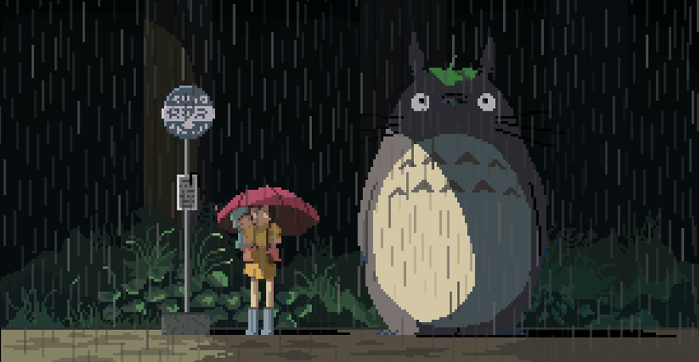

```python
#!/usr/bin/python


class SecurityEngineer:

    def __init__(self):
        self.name = "An Nguyen"
        self.role = "CS @ NTU Singapore"
        self.interests = ["pentesting", "CTFs", "PQC"]
        self.currently_learning = ["cryptography", "network", "eJPT"]
        self.blog = "https://panman4040.github.io/"

    def say_hi(self):
        print("Welcome abroad! Hope you're feeling cozy")


me = SecurityEngineer()
me.say_hi()
```
## 💻 Languages


## 🗂️ Highlight Projects
<a href="https://github.com/panman4040/password-checker">
  
</a>

<a href="https://github.com/panman4040/SC2002---Turn-based-Combat-Arena">
  
</a>

## 📊 My GitHub Stats
<a href="https://github.com/anuraghazra/github-readme-stats">
  
</a>
<a href="https://github.com/anuraghazra/convoychat">
  
</a>
